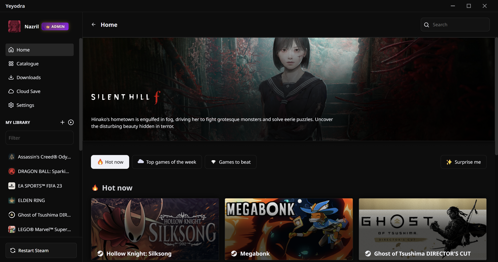
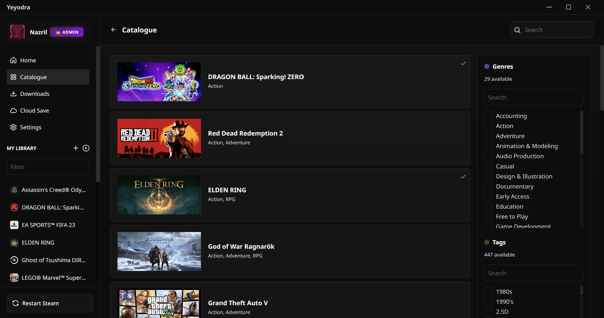
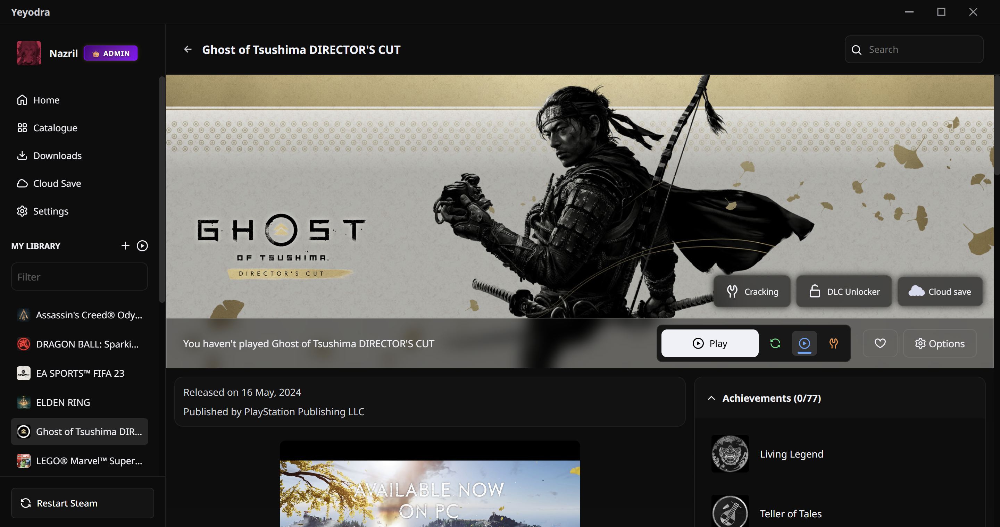
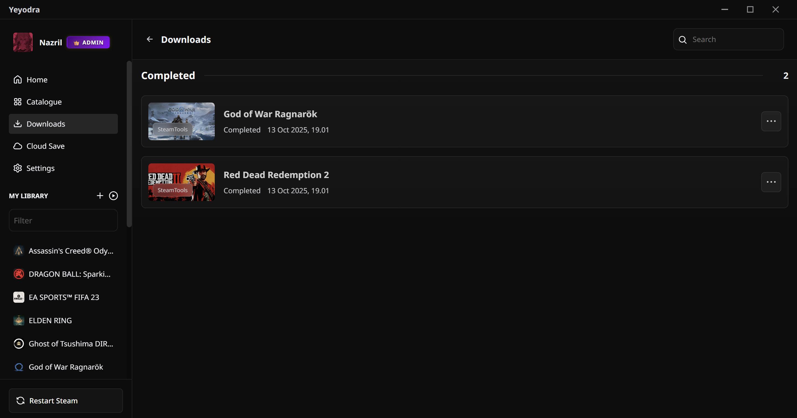
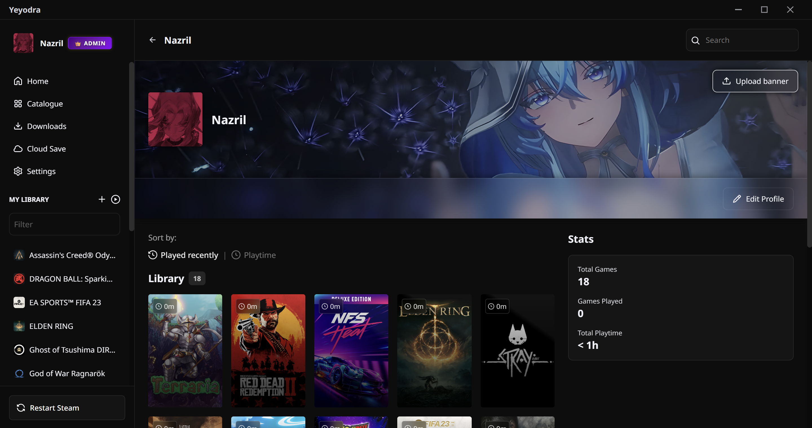

<div align="center">

# 🎮 Yeyodra Game Launcher

**A Modern, Feature-Rich Game Launcher for Windows**

[](LICENSE)
[]()
[]()
[]()

[Features](#-features) • [Screenshots](#-screenshots) • [Download](#-download) • [Installation](#-installation) • [FAQ](#-faq)

</div>

---

## ✨ Features

### 🎯 Core Features
- **📚 Game Library Management** - Organize and manage your game collection in one place
- **🔍 Game Catalogue** - Browse and discover games from multiple sources
- **⬇️ Advanced Download Manager** - Powered by aria2c for blazing-fast multi-threaded downloads
- **☁️ Cloud Save Sync** - Backup and restore your game saves to the cloud (Admin feature)
- **🎨 Modern UI** - Clean, intuitive interface with dark theme
- **🖼️ Custom Profiles** - Personalize your profile with custom avatars and banners

### 🛠️ Advanced Features
- **🎮 Custom Game Support** - Add non-catalogue games to your library
- **📊 Game Statistics** - Track your playtime and game collection stats
- **🔧 Game Cracking Tools** - Integrated cracking utilities for convenience
- **💾 Save Game Backup** - Powered by Ludusavi for comprehensive save backup
- **🎯 DLC Management** - Manage game DLCs separately
- **🔐 License System** - Secure license activation and validation

### 🚀 Performance
- **⚡ Lightning Fast** - Built with Rust backend for optimal performance
- **🔄 Multi-threaded Downloads** - Download multiple files simultaneously
- **💪 Low Resource Usage** - Efficient memory and CPU utilization
- **🎯 Smart Caching** - Intelligent data caching for faster load times

---

## 📸 Screenshots

<div align="center">

### Home Dashboard

*Clean and intuitive home dashboard showing your game library*

### Game Catalogue

*Browse thousands of games with advanced filtering options*

### Game Details

*Detailed game information with screenshots and download options*

### Download Manager

*Monitor all your downloads with real-time progress*

### User Profile

*Customize your profile with avatars and banners*


</div>

---

## 📥 Download


### System Requirements

| Component | Minimum | Recommended |
|-----------|---------|-------------|
| **OS** | Windows 10 (64-bit) | Windows 11 |
| **RAM** | 4 GB | 8 GB or more |
| **Storage** | 500 MB free space | 1 GB+ for games |
| **Internet** | Required for downloads | Broadband connection |

---

## 🚀 Installation

### Quick Start

1. **Download** the latest installer from [Releases](https://github.com/itsBintang/yeyodra/releases)
2. **Run** the installer (`Yeyodra-Setup-x.x.x.exe`)
3. **Follow** the installation wizard
4. **Launch** Yeyodra and activate your license
5. **Enjoy!** Start managing your game library

### First Time Setup

1. **License Activation**
   - Enter your license key when prompted
   - Contact support if you don't have a license

2. **Configure Settings**
   - Set your preferred download directory
   - Configure aria2c download settings
   - Customize interface preferences

3. **Add Games**
   - Browse the catalogue to find games
   - Add custom games via the "+" button in library
   - Import existing games from other launchers

---

## 🎮 Usage Guide

### Adding Games to Library

**From Catalogue:**
1. Go to **Catalogue** section
2. Browse or search for your game
3. Click on the game card
4. Click **Download** button
5. Game will be added to your library

**Custom Games:**
1. Click the **+** button in "MY LIBRARY" section
2. Browse and select game executable
3. Enter game title (auto-filled from filename)
4. Click **Add Game**

### Managing Downloads

- **Pause/Resume** downloads anytime
- **Queue management** with automatic processing
- **Download history** tracking
- **Bandwidth control** in settings

### Cloud Save Features (Admin)

- **Backup saves** to cloud storage
- **Restore saves** across devices
- **Auto-sync** option available
- **Version history** for save files

---

## ⚙️ Configuration

### Download Settings

Configure aria2c for optimal performance:

```
Max Connections: 16 (recommended)
Download Directory: Custom path
Auto-start downloads: Enabled
```

### Game Paths

Default paths:
- **Games**: `C:\Users\YourName\Documents\Yeyodra\games`
- **Downloads**: `C:\Users\YourName\Downloads`
- **Backups**: `C:\Users\YourName\AppData\Local\Yeyodra\backups`

---


## 🛠️ Built With

- **[Tauri](https://tauri.app/)** - Rust-based desktop framework
- **[React](https://reactjs.org/)** - UI framework
- **[TypeScript](https://www.typescriptlang.org/)** - Type-safe JavaScript
- **[Rust](https://www.rust-lang.org/)** - Backend language
- **[aria2c](https://aria2.github.io/)** - Download engine
- **[Ludusavi](https://github.com/mtkennerly/ludusavi)** - Save backup utility
- **[Vite](https://vitejs.dev/)** - Build tool

---

## 🔐 Security & Privacy

- 🔒 **License Validation** - Secure license verification system
- 🛡️ **Data Protection** - All user data stored locally
- 🔐 **Encrypted Cloud Saves** - Cloud backups are encrypted
- 🚫 **No Telemetry** - We don't collect usage data
- ✅ **Open Source** - Code available for review

---

---

## 📝 License

This project is licensed under the MIT License - see the [LICENSE](LICENSE) file for details.

---

## 🙏 Acknowledgments

- Inspired by [Hydra Launcher](https://github.com/hydralauncher/hydra)
- Icons from [Primer Octicons](https://primer.style/octicons/)
- UI components inspired by modern design patterns

---

## 📊 Statistics

<div align="center">


</div>

---


